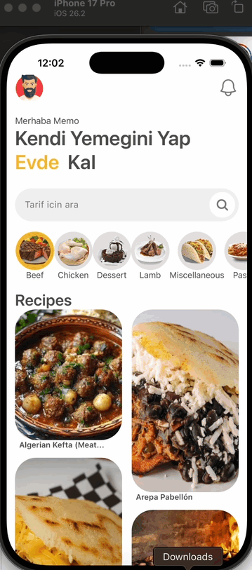

# Recipe App

A simple and modern recipe app built with React Native.  
Users can browse meal categories, view recipe details, ingredients, instructions, and watch recipe videos.

## Features

- Browse recipe categories
- View meals in a masonry layout
- Recipe detail screen
- Ingredients and measurements
- Cooking instructions
- YouTube recipe video
- Smooth animations
- Responsive design

## Tech Stack

- React Native
- React Navigation
- Axios
- TheMealDB API
- React Native Reanimated
- React Native Youtube Iframe
- NativeWind

## Preview

Add your app GIF here:

```md

